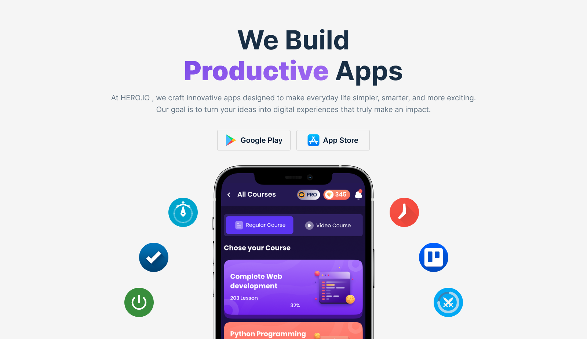

<h1 align="center">
    
</h1>

<h1 align="center">
  <a href="#">Hero Apps</a>
</h1>

<h3 align="center">A modern and responsive React-based App Store simulation 🚀</h3>

<p align="center">

  
  
   <a href="https://github.com/yourusername/apphub">
    
  </a>
    
  

  <a href="https://github.com/yourusername/">
    
  </a>
</p>

<h4 align="center"> 
	 ✅ Status: Finished & Deployed
</h4>

<p align="center">
 <a href="#about">About</a> •
 <a href="#features">Features</a> •
 <a href="#how-it-works">How it works</a> • 
 <a href="#tech-stack">Tech Stack</a> •  
 <a href="#author">Author</a> • 
 <a href="#user-content-license">License</a>
</p>

## 🎥 Live Demo

🔗 **Check out the live project here:**  
👉 [https://pha08-hero-apps.netlify.app](https://pha08-hero-apps.netlify.app)

## About

**Hero Apps** is a fully responsive React application that simulates an App Store experience — allowing users to browse, search, view, install, and manage apps seamlessly.

It integrates **React Router**, **Tailwind CSS**, **DaisyUi**, **React Icons**, **Recharts**, and **React Toastify** to deliver a smooth, modern, and visually appealing user experience.

---

## 🌟 Features

- [x] Responsive across all devices
- [x] Fully functional routing (Home, Apps, Installation, App Details)
- [x] Custom header with logo, navigation, and GitHub contribution button
- [x] Search and filter with live updates
- [x] Sorting by download count (High → Low / Low → High)
- [x] LocalStorage-based install & uninstall system
- [x] Toast notifications for install/uninstall actions
- [x] Lazy-loaded charts using Recharts
- [x] Full-screen loading animation for navigation & search
- [x] Custom 404 Error Page
- [x] Deployment ready (Netlify / Vercel / Cloudflare)
- [x] Zero 404 reload errors on production

---

## ⚙️ How it works

The application includes four main pages and persistent localStorage functionality.

### 🏠 Home Page

- Hero banner with title, description, and buttons for “App Store” and “Play Store”.
- Statistics section with custom cards.
- “Top Apps” section displaying the top 8 apps with ratings, downloads, and images.
- “Show All” button navigates to the All Apps page.

### 📱 All Apps Page

- Displays all apps from the JSON dataset.
- Live search filters apps by title (case-insensitive).
- “No App Found” message for unmatched searches.
- Each card links to its App Details page.

### 📊 App Details Page

- Displays complete app info: image, title, description, downloads, and rating.
- “Install” button:
  - Saves app to localStorage.
  - Shows success toast.
  - Changes to “Installed”.
- Review chart built with Recharts.

### 💾 My Installation Page

- Displays all installed apps (from localStorage).
- “Uninstall” button removes app and updates storage.
- Toast message confirms uninstall.
- Dropdown to sort by downloads (High-Low / Low-High).

### ❌ Error Page

- Custom 404 error page for invalid routes.
- Fully reload-safe deployment routing.

---

### 🧠 Pre-requisites

You need to have the following installed:

- [Git](https://git-scm.com)
- [Node.js](https://nodejs.org/en/)
- A code editor like [VS Code](https://code.visualstudio.com/)

### 🧩 Running the Application

```bash
# Clone this repository
$ git clone https://github.com/samibyte/pha08-hero-apps

# Access the project folder
$ cd pha08-hero-apps

# Install dependencies
$ npm install

# Run in development mode
$ npm run dev

# The app will open on your local server (usually http://localhost:5173)

```

---

## Tech Stack

Frontend Framework: React (Vite)
Routing: React Router v6
Styling: Tailwind CSS
Charts: Recharts (Lazy-loaded)
Notifications: React Toastify
Animations: CSS Animations / Framer Motion
State Management: React Hooks + localStorage
Deployment: Netlify / Vercel / Cloudflare
Version Control: Git & GitHub
